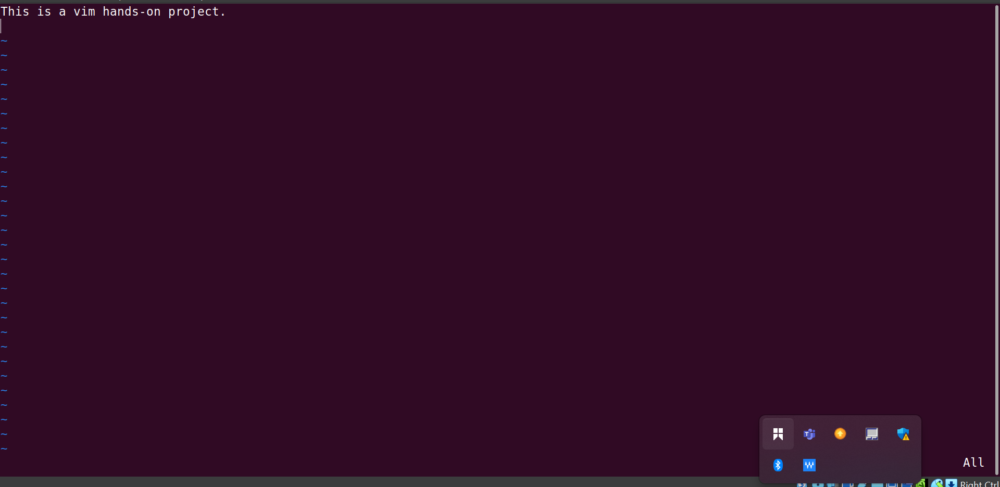

# Linux_Text_Editor-Mini_project

In this mini-project, we are discussing about the term linux text editor, and also look at some of the various types of linux text editor. But for the purpose of thi project we are focusing our explation on 'vim text editor and nano text editor".

# Linux Text Editor
This is a software application specifically design for creating , managing , and and modifying text files. Linux Text Editor provide a means for users to interact with and manipulate plain text files, configuration files , scripts, and other text-based enviroment.

## vim Text Editor
This is one of the types of linux text editor. it is a highly configurable and efficients for creating and editing any kind of text, especially codeand configuration files.

## working with vim
- open a file: you can open a file by running this command "vim exercise.txt. when you run this command it will create th file even if it does not exist and open the file up so that we cn start writting on it. 
. 

## enter insert mode
And once the file opened, you could not write or do anything on it untill you press " i " which means insert.

## moving arround :
to navigate through the text , you can use these keys:
- h : this key can be use to move in the left side of the text.
- j : if you want to move down in the text, you can use j on your keyboard.
- k : if you want to move up, 
- l : this is use when you want to move right.

## Deleting a character:
if you want delete a character in the text, make sure that you press esc on your keyboard to exist the insert mode. position the cursor on the character you want delete and press x.

## Deleting a line
to delete an entire line in the file , ensure that you rae not in insert mode. Then, place the cursoron a line and press "d" twice on your keyboard to delete the entire line.
 

## Undoing changes:
if you make some changes may be adding or deleting txt. press Esc to enter normal mode and then press "U" to undue the last change.
. in the picture i uploaded, i deleted an entire line but go back and undue it by pressing " u" in the normal mode.

## saving changes :
After you have finished writting into the files,press Esc then type :wq and hit enter. This will save the file."w" means write and "q" means quit which basically close the vim mode and return to the terminal.

## Quitting without saving:
incase you dont want save a file , press Esc and then tpe :q! and hit enter.
 and when go back it has been deleted because i did not save it.

# Nano Text Editor
Nano is also used for editing text files directly in the terminal. Nano is a simple and user-freindly command-line text editor.

## working with Nano;

- open a  file and name it nano_file.txt. by running this command " nano nano_file.txt

## saving changes:
To save your work by pressing ctrl + o. Nano will prompt you to confirmthe file name and hit enter.

## Existing Nano:
if you wish to exist nano without saving your work, simply press ctrl + x. if you have unsaved changes nano will prompt you to save before existing.

- i created a file and named it existing_file.txt by running this command " nano existing_file.txt", wwrote some content inside it and save .

this is a short explanation of how you can use a linux text editor.
